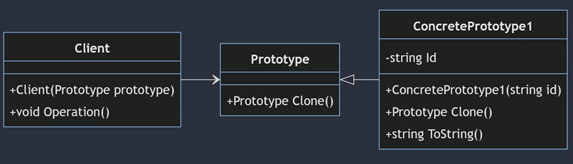
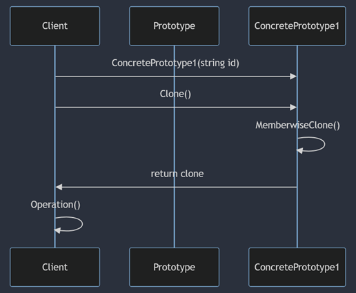
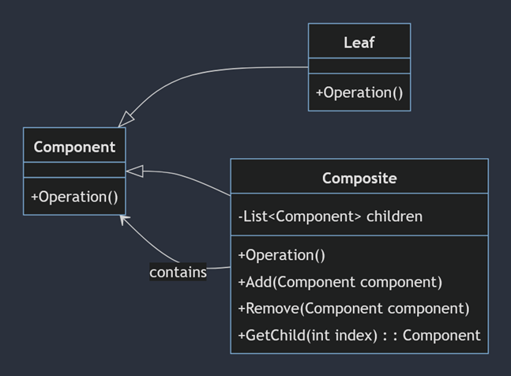
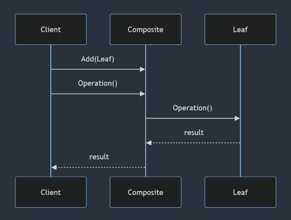
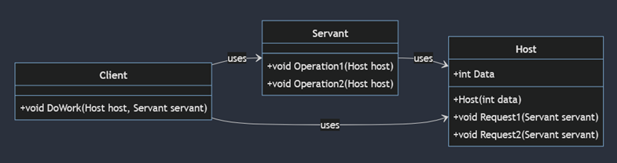
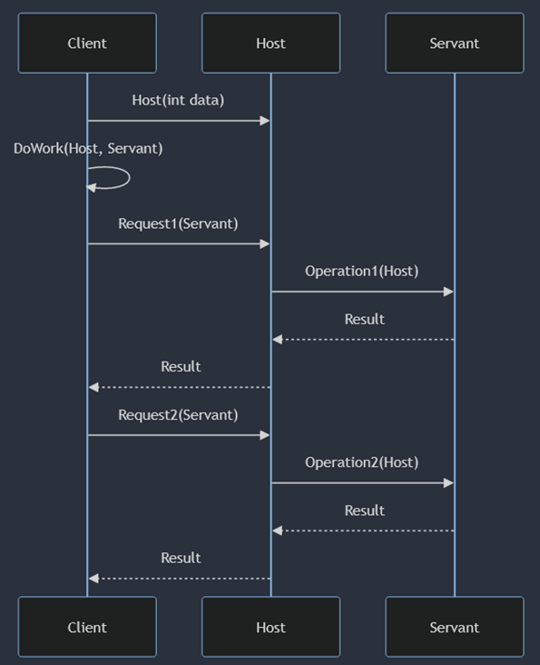
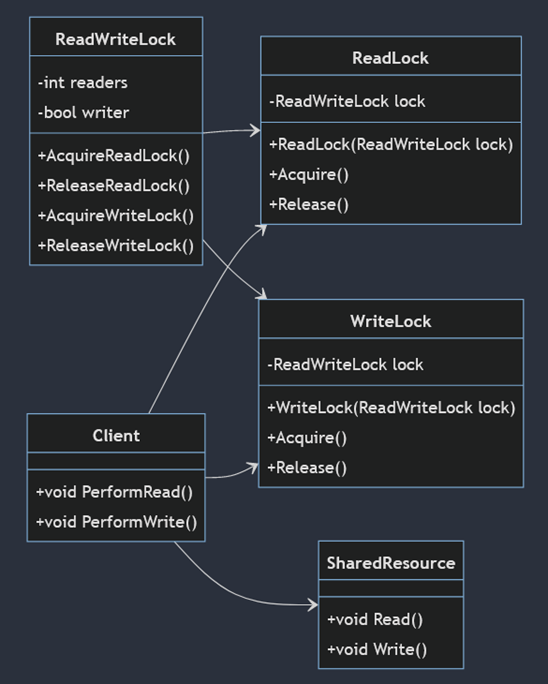
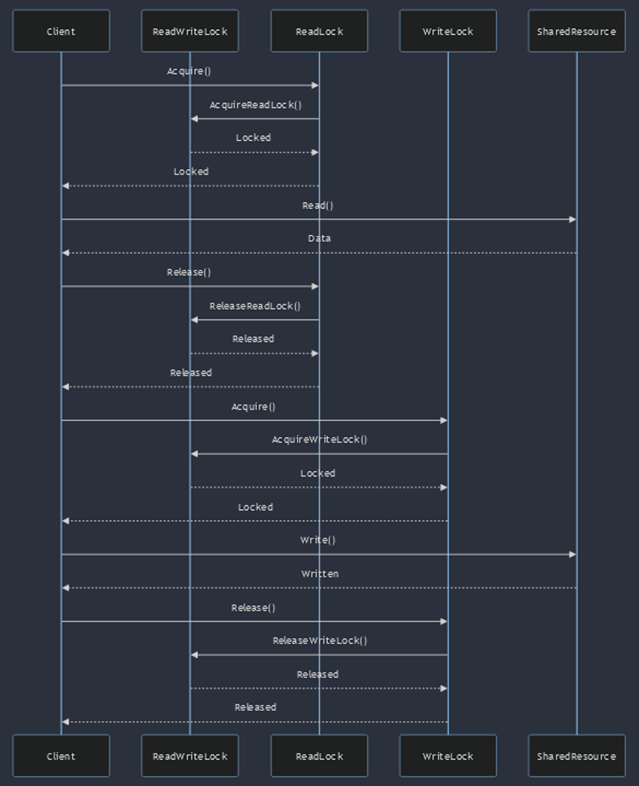

# Розрахункова робота

Дисципліна: Архітектура та проектування ПЗ \
Тема: Шаблони проєктування

## Моделі

### Prototype
Прототип — це породжуючий патерн, який дозволяє копіювати об’єкти будь-якої складності без прив’язки до їхніх конкретних класів. \
\
Усі класи-Прототипи мають спільний інтерфейс. Тому ви можете копіювати об’єкти, не звертаючи уваги на їхні конкретні типи та бути завжди впевненими в тому, що отримаєте точну копію. Клонування здійснюється самим об’єктом-прототипу, що дозволяє йому скопіювати значення всіх полів, навіть приватних. \
\
Патерн Прототип реалізовано в базовій бібліотеці C# за допомогою інтерфейсу ICloneable.

Основні структурні елементи:
+ Prototype: Абстрактний клас або інтерфейс, який визначає метод для клонування самого себе.
+ ConcretePrototype: Конкретна реалізація прототипу, яка реалізує операцію клонування для створення копії самого себе.
+ Client: Клас, який створює нові об'єкти, запитуючи прототипа на клонування самого себе.  

### Composite
Компонувальник — це структурний патерн, який дозволяє створювати дерево об’єктів та працювати з ним так само, як і з одиничним об’єктом. \
\
Компонувальник давно став синонімом всіх завдань, пов’язаних з побудовою дерева об’єктів. Всі операції компонувальника базуються на рекурсії та «підсумовуванні» результатів на гілках дерева. \
\
Патерн Компонувальник зустрічається в будь-яких завданнях, які пов’язані з побудовою дерева. Найпростіший приклад — складені елементи GUI, які теж можна розглядати як дерево.

Основні структурні елементи:
+ Component: Визначає загальний інтерфейс для всіх об'єктів у складі.
+ Leaf: Реалізує операцію для окремих об'єктів.
+ Composite: Реалізує операцію для складових об'єктів і дозволяє додавати, видаляти і отримувати дочірні елементи.
+ Client: Працює з об'єктами через інтерфейс Component, не розрізняючи окремі об'єкти і групи об'єктів.

### Servant
Слуга — шаблон проєктування, який дозволяє визначити спільний функціонал для різних ієрархій класів. \
\
Шаблон використовується для надання спільної функціональності кільком об'єктам без дублювання коду. \
\
Це особливо корисно, коли один і той же метод має виконуватися на різних об'єктах.

Основні структурні елементи:
+ Servant: Клас, який надає спільну функціональність.
+ Host: Клас, який містить дані і делегує виконання методів слузі.
+ Client: Клас, який використовує об'єкти хоста і слуги для виконання операцій.

### Read Write Lock
Read-Write Lock – це шаблон проєктування, що забезпечує механізм, який дозволяє декільком потокам одночасно читати спільний ресурс, але обмежує доступ до запису, забезпечуючи таким чином коректність даних.\
\
Це особливо корисно в багатопоточних програмах, де операції читання значно переважають над операціями запису. 

Основні структурні елементи:
+ ReadWriteLock: Клас, який управляє блокуваннями для читання і запису.
+ ReadLock: Клас, який представляє блокування для читання.
+ WriteLock: Клас, який представляє блокування для запису.
+ SharedResource: Клас, який містить ресурс, до якого здійснюється доступ.
+ Client: Клас, який використовує блокування для доступу до спільного ресурсу.
